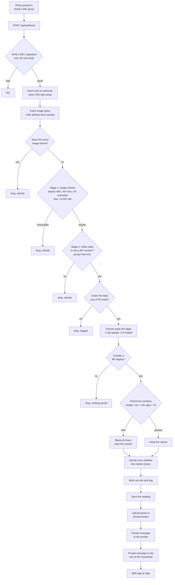

# bp-logger

A LINE bot that reads blood pressure monitor photos and turns them into a printable table for
a doctor's appointment.

Someone photographs the monitor and posts it in the family group chat. The bot reads the SYS,
DIA and pulse digits, checks them, and saves the reading with the photo attached. It replies
privately to the sender, not in the group. Before an appointment, anyone in the household
opens the web app and prints a one-page summary.

Built for one household. It replaces a table that was written out by hand.

Two companion docs: [decisions.md](docs/decisions.md) for why it's built this way, and
[evaluation.md](docs/evaluation.md) for how well the OCR does.

## The problem

The household already had a habit. Photograph the monitor, post it in the family LINE group.

The doctor wants a table. Producing it meant scrolling back through months of chat and
copying numbers out by hand, usually the night before the appointment.

So the rule for this project was that nobody has to change what they already do. No new app,
no command, no format. Take the photo, post it in the group.

That rule explains most of the design. Photos arrive through a webhook on the group that
already exists. The bot answers privately so the group stays usable. A reading the OCR
couldn't parse still gets saved and still shows up, because a dropped reading is worse than a
flagged one.

## How it works

From `lib/worker.ts` and `app/api/webhook/route.ts`.



Every rejection before the OCR step is silent. Most photos in a family group aren't monitors,
and a bot announcing each one it ignored would be unusable.

You can also type numbers. `120/70/60` in the group saves a reading with no photo. If the OCR
missed a field, the bot asks and you reply with that number. Three numbers in the private chat
within an hour of a reading overwrite it. All of this is in `handleText` in `lib/worker.ts`.

A cron job runs twice a day and reminds people about slots they haven't logged. It skips
households quiet for a week.

## Stack

| Layer | Choice | Why |
|---|---|---|
| Framework | Next.js 16.3.0, React 19.2.8 | API routes and web app ship together |
| Hosting | Vercel | `waitUntil` for work after the response, plus cron |
| Chat | LINE Messaging API, LIFF 2.30 | LIFF is LINE's in-app browser with a login token |
| OCR | Anthropic SDK 0.116, `claude-sonnet-4-6` | reads seven-segment digits through glare |
| Triage | `claude-haiku-4-5-20251001` | cheap yes/no filter before the expensive read |
| Images | sharp 0.35 | EXIF rotation, downscale, rotations for OCR |
| Data | Supabase 2.112 | Postgres plus a private bucket for photos |
| Charts | recharts 3.10 | trends page only |
| Export | html2canvas-pro 2.3 | the fork, for a reason in decisions.md |
| Styling | Tailwind v4, TypeScript 5 | |

Only `next`, `react`, `react-dom` and `eslint-config-next` are pinned exactly.

## How well it reads

Run 2026-08-29 against 45 labelled photos. Precision counts only fields where the model gave
an answer, since it returns null when unsure.

| | dev (25 images) | held out (20 images) |
|---|---|---|
| Correct | 59 of 75 fields | 48 of 60 fields |
| Wrong | 3 | 2 |
| Abstained | 13 | 10 |
| Precision | 95.2% | 96.0% |
| Wrong values that slipped past review | 0 | 1 |

Ten photos that aren't monitors: all rejected. Five with digits covered: all eight covered
fields came back null.

That one value slipping past review is reproducible and it's the most interesting result
here. [evaluation.md](docs/evaluation.md) covers what happened and what to do about it.

## Running cost

Haiku triages, Sonnet reads. Per call, using published rates and a measured average image
size of about 2,600 tokens: triage $0.0028, read $0.0124.

An upright photo costs one triage plus one read. A rotated one costs four reads, since all
three rotations get tried. 5 of 60 labelled photos are rotated, averaging 1.25 reads per
photo, so about **$0.018 per reading**. At 90 readings a month that's **$1.64**, plus $0.0028
of triage for every non-monitor photo posted in the group.

## Setup

1. **LINE Messaging API channel.** Webhook at `https://<host>/api/webhook`. Enable webhooks,
   disable auto-reply, subscribe to `message` and `memberJoined`. Members must add the account
   as a friend or LINE returns 403 and the bot marks them unreachable.
2. **LIFF app** on a LINE Login channel, endpoint `https://<host>/app`, scopes `openid` and
   `profile`. Without `openid` there's no ID token and the app won't start.
3. **Supabase project** with a private bucket called `readings`. Photos are served only
   through short-lived signed URLs.
4. **Vercel deploy.** `vercel.json` already declares both cron entries.

The schema isn't in this repo. `lib/db.ts` is the closest thing to a definition.

| Variable | Required | Notes |
|---|---|---|
| `LINE_CHANNEL_SECRET` | yes | verifies the webhook signature |
| `LINE_CHANNEL_ACCESS_TOKEN` | yes | fetching images, sending messages |
| `LINE_LOGIN_CHANNEL_ID` | yes | throws on startup if missing |
| `NEXT_PUBLIC_LIFF_ID` | yes | the only one exposed to the browser |
| `SUPABASE_URL` | yes | |
| `SUPABASE_SERVICE_KEY` | yes | service role, server only |
| `ANTHROPIC_API_KEY` | yes | read by the SDK, never through `process.env` |
| `CRON_SECRET` | for reminders | without it the cron route always returns 401 |
| `ALLOWED_GROUP_ID` | optional | comma-separated allow-list, empty means any group |

`.env.example` lists all nine.

## Local development

```bash
npm install && npm run dev
ngrok http 3000     # LINE needs a public URL to deliver webhooks
```

Put the ngrok URL in the channel's webhook setting and the LIFF endpoint. Both change every
time ngrok restarts on the free tier.

The eval scripts make real API calls and read their key from `.env.local`:

```bash
npx tsx --env-file=.env.local scripts/eval.ts dev        # or test, synthetic, negative
npx tsx --env-file=.env.local scripts/prefilter-test.ts
npx tsx --env-file=.env.local scripts/prefilter-test.ts --stage1   # free, no API calls
```

Accuracy runs print a report and dump every prediction to `eval/results/<split>.json`, so you
can re-score at a different review threshold without paying for another run.

`eval/samples/` is gitignored, so the scripts won't run from a fresh clone. Those are real
photos of a family member's device. `eval/results/` holds the committed output.

No unit tests, no CI.

## Limitations

Design constraints rather than bugs.

**One household per LINE user.** `members.user_id` is the primary key, so a user in two
allowed groups gets moved to whichever they used last. Fixing it means a schema change.

**Isolation lives in application code.** The server uses the Supabase service key, which
bypasses row-level security, and there are no RLS policies. Every query filters on `group_id`
by hand. A missing filter in a new route would leak across households with nothing to catch
it.

**Slot assignment is a guess.** Readings get filed by clock time, and slots close together
will sometimes catch the wrong one. Every row lets you change it.

**Nothing is timed.** No latency instrumentation, and token usage is never logged. Any
performance claim about this system would be invented.

**Photos go to a third-party API.** That's the tradeoff at the centre of the project.

## Reuse

Personal project. It isn't set up for other people to deploy and I'm not taking requests to
host it.

Photos of a family member's medical device go to a third-party API. One household agreed to
that. Running it for anyone else would mean holding other people's health data, which brings
obligations under Thailand's PDPA I'm not equipped to meet.

Read the code, take the ideas.

## Status

Deployed and running in one family group.